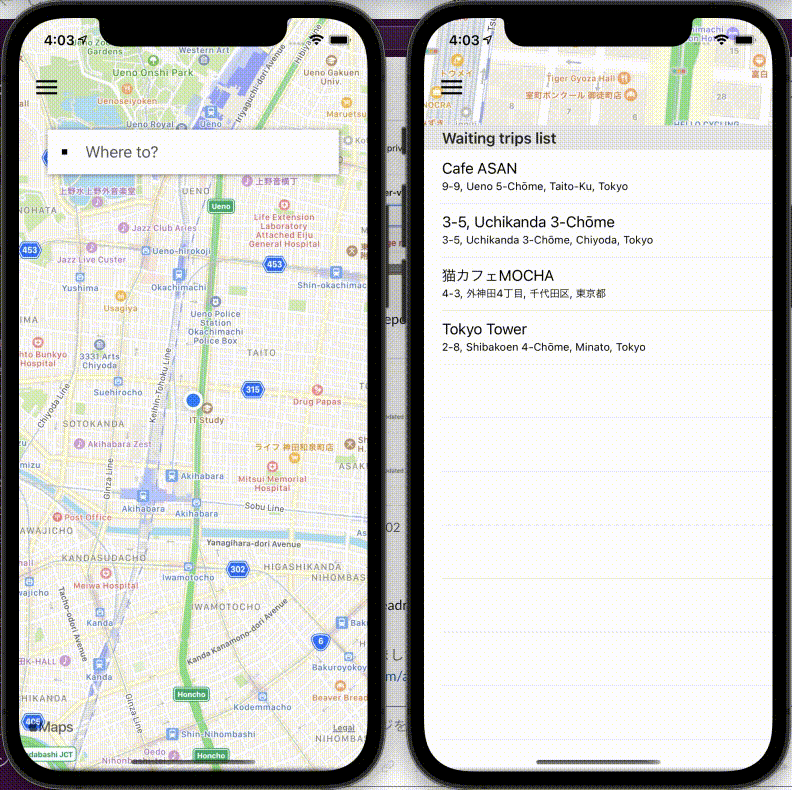

# Muber - An app for moving
Have you ever thought:
1. Moving companies are expensive
2. Getting a quotation from a moving company takes time and can be a hassle
3. Can't do all the moving alone
4. Is there someone else willing to help me move?

You've come to the right place! 

**Muber** is a moving arrangement platform that connect those who need help moving to those who have big vehicles and are willing to help people move. 
Simply create an account and start moving!

## 👁 Preview

# 🏃 Getting started
1. If you do not have TestFlight installed on your iPhone already then go to the App Store and download the app and set it up first. If you already have TestFlight, skip to step 2.
2. Once you have TestFlight installed and set up, open this link on your iPhone browser https://testflight.apple.com/join/g4zK2fzL
3. Click on **Start Testing** under Step 2 - Join the Beta and this will take you to TestFlight.
4. When muber-test shows up, click **ACCEPT** then **INSTALL** to download the muber-v2 beta app.
5. Open the muber-v2 beta app. 
6. Click **Next** after reading the Developers Note then click **Start Testing**. Voila! You can start testing our app.

Please send us any feedback!

# 📲 How to use the app
There are two types of account a user can create. **Rider | Mover**

### 🙎 Rider side of app
1. Sign up with an your name, email and password and select *Rider* as the user type.
2. Accept the location service request to enable location services. 
3. Once loction services is enabled, click on the **Where to?** search bar and input your desired destination in the **Enter a destination** bar.

5. Click on one of the destination result to see the route from your current location to the destination.
6. Click **Set date** and select your desired date and time for the moving. 
7. Next click on **Add items** 
8. In the items section. Add all the items you would like help to move with a good description. Also, include your desired reward/compensation for the driver
9. Once done, click on **Confirm** to go to the confirmation page and go over your details one more time. 
10. Click on **Confirm** to send your moving request. 
11. Please wait till you get paired with a Mover.

### 🚐 Mover side of app
1. Sign up with an your name, email and password and select *Mover* as the user type.
2. Accept the location service request to enable location services. 
3. Once loction services is enabled, select a requested trip from the **Waiting trips list** and click **See Detail** to proceed.
4. If the information provided is acceptable, click confirm to lock in the request!

# 🔮 Upcoming features
#### UI/UX enhancements
- In app messaging
- Push notifications

#### Commercial enhancements
- Matching service
- Furniture setup and build service
- Simple delivery service

#### Simulation with AI/AR
- Perfect matching with AI
- Measure furniture size with AR
- Simulate placement with AR

# 💻 Technologies used
- **Swift** with **UIKit** for frontend 
- **Firebase Realtime Database** and **Firebase Authentication** for backend
- **Apple MapKit** for navigation system
- **Github** for team collaboration 
- **TestFlight on App Store** for deployment
- **Slack** and **Discord** for communication
